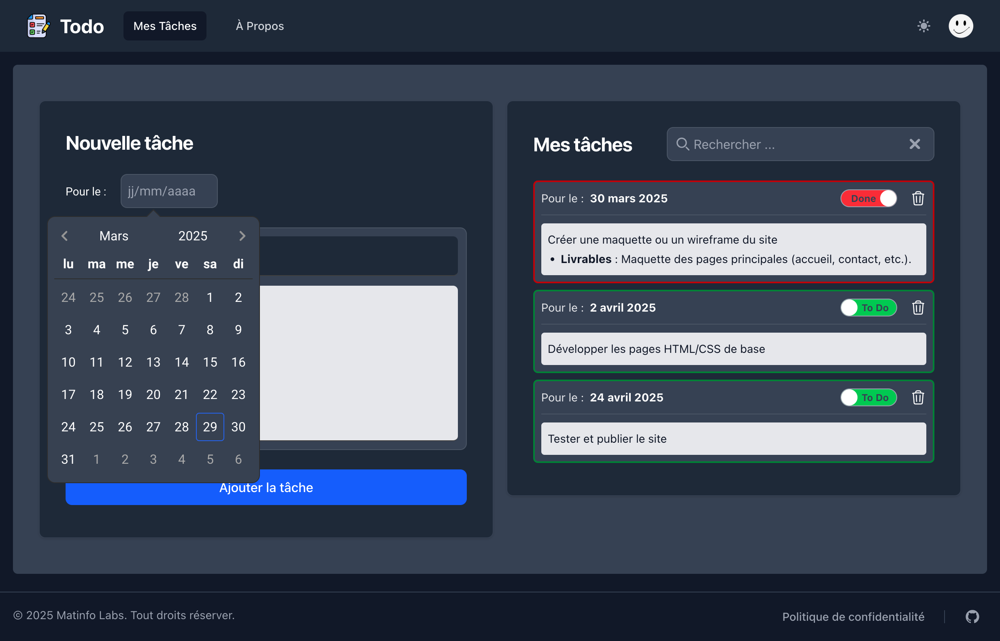
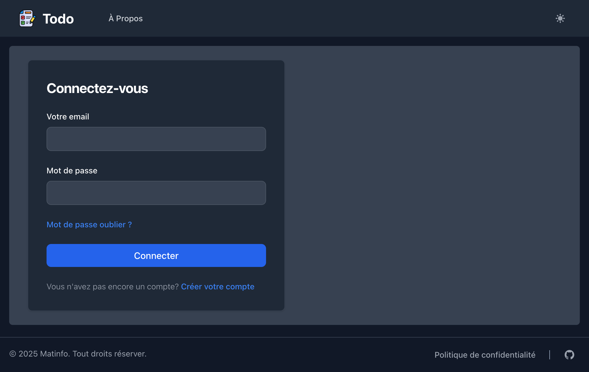
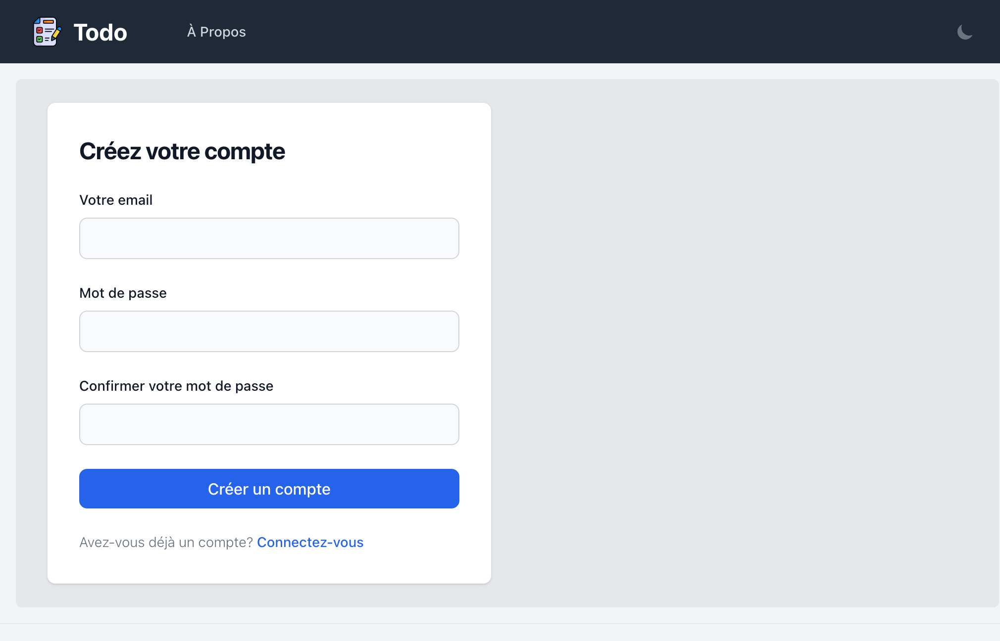
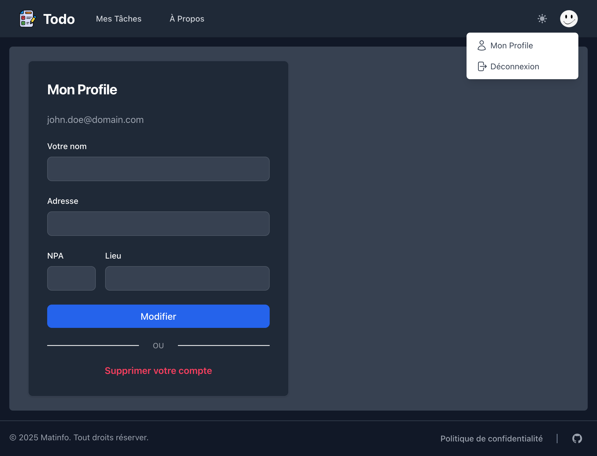

# todo-app

This simple Todo app use in frontend responsive made with Vue3 using TypeScript and 
TailWinCSS for the HTML view.

The backend API is made with Node.js 20+ and Express and MySQL for data storage.

The frontend offer the possibility to switch from *Dark* ot *Light* theme.

To run respectively the backend and the frontend, find for each the instruction in the README files.

- [Backend](./backend/README.md)
- [Frontend](./frontend/README.md)

## The interface

### Todos

### Login

### Register

### Profile

